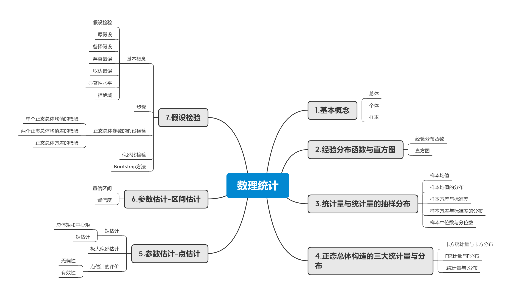

# 金融市场的基础概念

这节课是经济学基础了，我因为有底子，所以基本就是复习一下

量化投资就像是金融市场的精密导航系统。宏观经济学和货币金融学提供了经济地图和气象报告，帮助投资者理解市场环境和趋势。投资基础学则是驾驶手册，教授如何评估资产价值和风险，以及如何配置投资组合。数理统计与估算则是高精度的GPS，通过数据分析和模型预测，指导投资者在复杂的市场环境中找到最佳路径。这些学科的结合，让量化投资不仅基于直觉，更依赖于科学的方法论和严谨的数据分析。

 **宏观经济学及宏观调控的重要指标：**
1. **GDP（国内生产总值）** - 衡量一个国家在一定时期内生产的所有最终商品和服务的市场价值。
2. **失业率** - 劳动力市场中没有工作的人数占劳动力总数的比例。
3. **通货膨胀率** - 商品和服务价格水平上升的百分比。
4. **利率** - 借款成本的衡量，通常由中央银行设定。
5. **财政赤字** - 政府支出超过收入的金额。
6. **贸易平衡** - 出口与进口的差额。
7. **消费者价格指数（CPI）** - 衡量消费品和服务价格变化的指数。
8. **生产者价格指数（PPI）** - 衡量生产者出售商品和服务的价格变化。
9. **货币供应量** - 经济中流通的货币总量。
10. **消费者信心指数** - 消费者对未来经济状况的乐观程度。
11. **工业生产指数** - 衡量工业产出的指标。
12. **零售销售** - 零售业销售总额。
13. **住房开工率** - 新建住房项目的开始数量。
14. **个人收入** - 居民个人获得的收入。
15. **个人储蓄率** - 个人储蓄占可支配收入的比例。
16. **资本形成总额** - 用于投资的资本支出。
17. **政府债务占GDP比例** - 政府债务与国内生产总值的比率。
18. **经常账户余额** - 一个国家与世界其他国家的贸易和投资净额。
19. **货币贬值率** - 货币相对于其他货币的价值变化。
20. **劳动生产率** - 单位劳动投入产出的价值。

**货币金融学及货币调控的重要指标：**
1. **货币供应量（M1, M2, M3）** - 经济中流通的货币总量，包括现金、活期存款等。
2. **银行准备金率** - 商业银行必须在中央银行保留的资金比例。
3. **信贷增长率** - 银行贷款增长的速度。
4. **债券收益率** - 债券持有者获得的利息收入与债券面值的比率。
5. **汇率** - 一国货币与另一国货币之间的兑换比率。
6. **外汇储备** - 一个国家持有的外国货币资产。
7. **央行政策利率** - 中央银行设定的基准利率。
8. **货币市场利率** - 短期债务工具的利率。
9. **银行间同业拆借利率** - 银行之间短期借贷的利率。
10. **货币流通速度** - 货币在经济中流通的速度。
11. **货币乘数** - 基础货币变动对货币供应量的影响。
12. **货币需求** - 经济主体对货币的需求。
13. **金融稳定性指标** - 评估金融系统稳定性的指标。
14. **信贷风险溢价** - 信贷成本中反映的风险部分。
15. **银行资本充足率** - 银行资本与风险加权资产的比例。
16. **非银行金融机构活动** - 非银行金融机构在金融市场的活动。
17. **金融资产价格** - 股票、债券等金融资产的市场价格。
18. **金融衍生品市场** - 期货、期权等衍生品的交易市场。
19. **金融监管政策** - 监管机构制定的规则和指导原则。
20. **金融创新** - 新的金融产品、服务或交易方式的引入。

**投资基础学的重要指标：**
1. **股票收益率** - 股票价格变动带来的收益。
2. **市盈率（P/E Ratio）** - 衡量股票价格相对于每股收益的比率。
3. **股息收益率** - 公司支付的股息与股票价格的比率。
4. **贝塔系数（Beta）** - 衡量个别股票相对于整体市场的风险性。
5. **夏普比率（Sharpe Ratio）** - 衡量投资组合的风险调整后回报率。
6. **股票市值** - 公司的总市场价值。
7. **市净率（P/B Ratio）** - 衡量股票价格与公司净资产价值的比率。
8. **企业价值/EBITDA（EV/EBITDA）** - 衡量企业价值相对于其经营现金流的比率。
9. **自由现金流（FCF）** - 公司运营产生的现金减去资本支出。
10. **债务/EBITDA比率** - 衡量公司偿债能力的指标。
11. **股本回报率（ROE）** - 净利润与股东权益的比率。
12. **资产回报率（ROA）** - 净利润与总资产的比率。
13. **净现值（NPV）** - 投资项目现金流的现值减去初始投资。
14. **内部收益率（IRR）** - 使项目净现值为零的贴现率。
15. **投资组合标准差** - 衡量投资组合风险的指标。
16. **投资组合相关性** - 衡量投资组合中不同资产价格变动的相关性。
17. **有效边界** - 投资组合理论中，风险与回报权衡的最优组合。
18. **市场资本化率** - 整个市场的平均市盈率。
19. **市场波动率** - 市场价格变动的幅度。
20. **市场流动性** - 市场参与者买卖资产的容易程度。

**数理统计与估算的基础指标：**
1. **均值（Mean）** - 数据集中所有数值的平均值。
2. **中位数（Median）** - 数据集中位于中间位置的数值。
3. **方差（Variance）** - 衡量数据分散程度的统计量。
4. **标准差（Standard Deviation）** - 方差的平方根，表示数据的波动幅度。
5. **相关系数（Correlation Coefficient）** - 衡量两个变量之间线性关系强度的统计量。
6. **协方差（Covariance）** - 衡量两个变量联合变化程度的统计量。
7. **回归分析** - 预测一个变量基于另一个或多个变量的值。
8. **回归系数** - 线性回归模型中自变量对因变量变化的敏感度。
9. **R平方（R-squared）** - 回归模型解释因变量变异的比例。
10. **置信区间（Confidence Interval）** - 估计值周围的一个区间，用于估计总体参数。
11. **假设检验（Hypothesis Testing）** - 统计方法，用于验证关于总体参数的假设。
12. **p值（p-value）** - 假设检验中，观察到当前数据或更极端情况的概率。
13. **t分布（t-distribution）** - 用于小样本数据的假设检验。
14. **F分布（F-distribution）** - 用于方差分析和回归分析中的假设检验。
15. **ANOVA（方差分析）** - 比较两个或多个样本均值差异的统计方法。
16. **回归模型残差** - 观测值与模型预测值之间的差异。
17. **偏差（Bias）** - 估计值与真实值之间的差异。
18. **方差（Variance）** - 估计值的分散程度。
19. **标准误差（Standard Error）** - 估计值的准确性。
20. **贝叶斯定理** - 根据新证据更新概率估计的方法。

