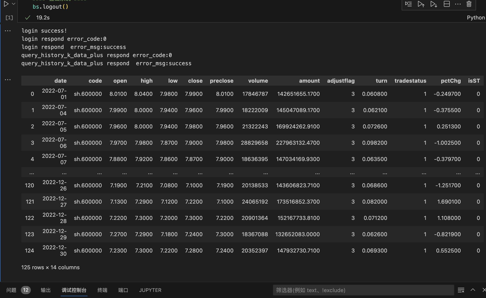
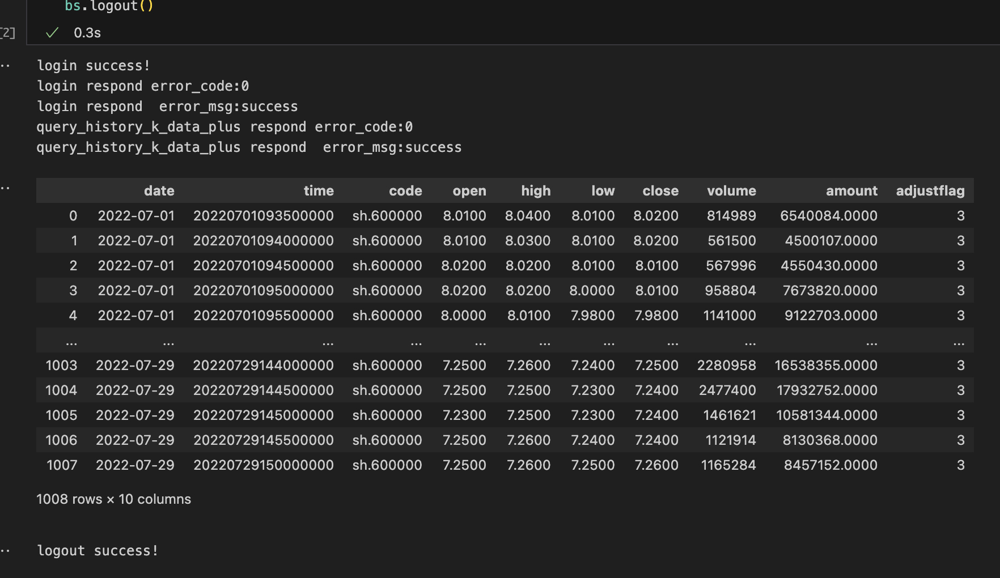
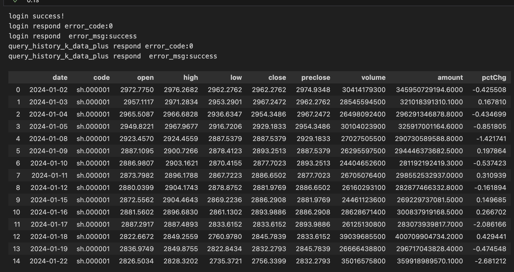
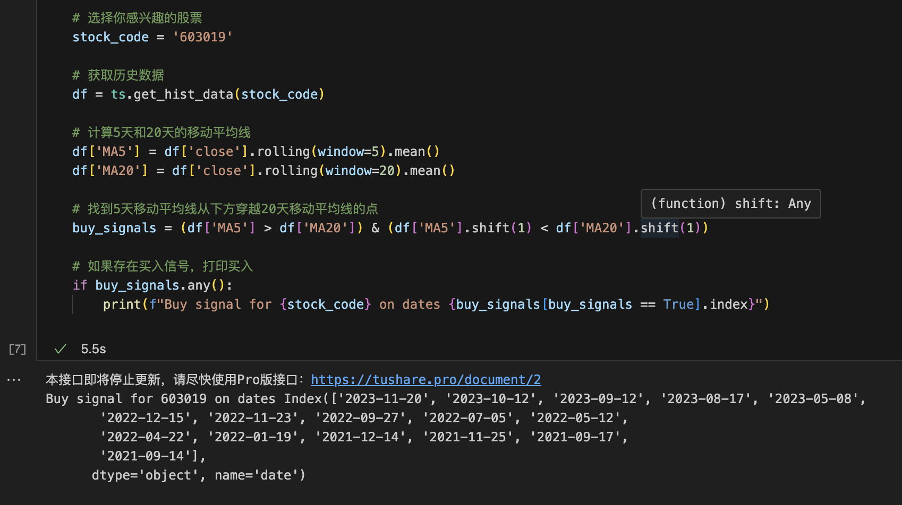

# 股票数据获取

本节的内容是获取股票数据，为后续的分析做准备.
本节课的内容包括股票数据的基本分类，常见指标介绍，技术面和基本面的常见指标，以及股票数据的获取方法。
代码部分介绍了baostock.com和tushare.pro。

## 股票数据的基本分类
股票数据根据信息来源和分析方法的不同，可以分为技术面数据和基本面数据。

- 技术面
技术面数据是通过股票的历史价格和交易量等市场数据进行计算和分析得出的指标。它的核心观点是市场行为会在价格上留下痕迹，通过这些痕迹可以预测未来的价格走势。技术面数据主要关注股票价格的变动和市场趋势，常用的技术指标包括移动平均线、相对强弱指标、MACD指标等。技术面分析认为市场上已有的信息都会反映在股票价格中，因此通过分析股票价格图表和技术指标，可以尽可能准确地判断价格的走势和市场趋势。

- 基本面
基本面数据是通过分析公司的财务状况、业绩表现、竞争力等基本信息得出的评估。基本面分析认为股票的价格是与公司的基本面因素相关的，包括公司的营业收入、盈利能力、资产负债情况、市场份额、竞争优势等。基本面分析的目标是评估公司的内在价值，并基于这些评估来判断股票的投资潜力。常用的基本面指标包括市盈率、市净率、股息率等。基本面数据通常需要通过公司公开的财务报告和公告来获取。

## 股票数据的常见指标介绍

-移动平均线（Moving Average, MA）

移动平均线是通过计算一段时间内的股票平均价格来平滑价格波动。常见的移动平均线有简单移动平均线（SMA）和指数移动平均线（EMA）。

简单移动平均线（Simple Moving Average, SMA）：简单移动平均线是最基本的移动平均线类型。它是通过将一段时间内的股票收盘价相加，然后除以时间段的天数来计算的。简单移动平均线可以平滑价格波动，显示出长期趋势。

指数移动平均线（Exponential Moving Average, EMA）：指数移动平均线对近期价格给予更高的权重，反映了市场更近期的变化。计算指数移动平均线时，当前价格会根据选定的时间段和权重系数，与之前的移动平均线值相结合。

- 相对强弱指数（Relative Strength Index, RSI）

RSI 是一种用于衡量股票价格变动强度和速度的技术指标。它可帮助投资者判断股票市场的超买和超卖情况，以及价格的反转和确认信号。

RSI 的计算基于一定时期内股票价格的平均涨幅和跌幅。通常情况下，RSI的取值范围在0到100之间。

RSI 的数值解读如下：
RSI在0到30之间：表示股票市场被超卖，可能存在价格反弹的机会。
RSI在70到100之间：表示股票市场被超买，可能存在价格下跌的机会。
RSI在30到70之间：表示股票市场相对平稳，没有明显的超买或超卖信号。

- 随机指标（Stochastic Oscillator）

随机指标用于判断股票价格的超买和超卖情况，以及价格反转的可能性。它可以帮助投资者确定适合买入或卖出股票的时机。

随机指标的计算基于一段时间内的收盘价与最高价和最低价的关系。该指标通常使用 %K 线和 %D 线两条线，并结合超买区和超卖区进行解读。

随机指标的数值解读如下：

当 %K 线从下方穿越%D线时，被视为买入信号，可能预示着价格的反转和上涨。
当 %K 线从上方穿越%D线时，被视为卖出信号，可能预示着价格的反转和下跌。
当 %K 线位于高位（一般超过80）时，表示市场可能超买，价格的下跌风险增加。
当 %K 线位于低位（一般低于20）时，表示市场可能超卖，价格的上涨机会增加。

- 成交量指标（Volume）

成交量指标衡量了股票交易的活跃程度。当股票价格上涨时，成交量增加可以视为价格上涨的确认，而当股票价格下跌时，成交量增加可能表示价格下跌的确认。

- MACD 指标（Moving Average Convergence Divergence）

MACD 指标是股票技术分析中常用的趋势追踪和买卖信号指标。它通过比较两条移动平均线的差异，来判断股票价格的趋势以及价格的买卖信号。

趋势判断：当 DIF 线与 DEA 线发生金叉（DIF 线向上穿过 DEA 线）时，表示价格可能出现上涨趋势；当 DIF 线与 DEA 线发生死叉（DIF 线向下穿过 DEA线）时，表示价格可能出现下跌趋势。

买卖信号：当 MACD 柱由负值转为正值时，被视为买入信号；当 MACD 柱由正值转为负值时，被视为卖出信号。这些转折点可能表示价格快速波动的转变。

背离信号：观察价格和 MACD 指标的背离情况。例如，当价格创新高而 MACD 指标未能创新高时，可能表示价格上涨动能下降，可能出现价格回调。

## 基本面数据常见指标

- 每股收益（Earnings Per Share, EPS）

每股收益用于衡量公司每股可供股东分配的净利润，即每股盈利能力。每股收益是投资者评估公司盈利能力和估值的重要参考指标之一。

每股收益的计算公式为：EPS = 净利润 / 流通股本

其中，净利润是指公司在一定会计周期内所创造的净收益，即扣除各项费用和税后利润。流通股本是指公司已经发行并在市场上自由交易的股票数量。

- 市净率（Price-to-Book Ratio, P/B Ratio）

也称为股价净资产比，是一种用于衡量股票当前市场价格与公司每股净资产之间关系的指标。它是用来评估公司的市场估值是否低估或高估的重要指标。

市净率的计算公式为：市净率 = 公司总市值 / 公司净资产

其中，公司总市值是指公司所有已发行股票的市值之和，而公司净资产是指公司的总资产减去总负债。

市净率是一个相对指标，一般用来比较同行业或同一市场的公司。较低的市净率通常被认为是公司股票被低估的迹象，而较高的市净率可能意味着公司股票被高估。

- 股息收益率（Dividend Yield）

股息收益率用于衡量股票派发的股息相对于股票的价格的比率。股息是公司利润的一部分，以现金或股票形式派发给股东。股息收益率可以帮助投资者评估持有一只股票所能获得的现金回报。

股息收益率的计算公式为：股息收益率 = 每股股息 / 股票价格

其中，每股股息是指公司每股派发的股息金额，股票价格是股票在市场上的交易价格。

- 净利润（Net Profit）

净利润用于衡量一家公司在特定会计期间内实际获得的净收益，即扣除各项费用和税后利润。净利润是评估公司盈利能力和基本经营状况的重要指标。

净利润的计算公式为：净利润 = 总收入 - 总成本 - 税收 - 其他费用

- 负债与资产比率（Debt-to-Asset Ratio）

负债与资产比率用于衡量公司的资本结构和债务风险水平。该比率反映了公司负债占总资产的比例（财务杠杆），可以帮助投资者了解公司负债情况以及对负债承受能力的评估。

负债与资产比率的计算公式为：负债与资产比率 = 总负债 / 总资产

其中，总负债是指公司在特定时点上的所有债务总额，包括长期负债和短期负债。总资产是指公司在特定时点上的全部资产，包括流动资产和固定资产。

## 数据获取

参考资料是
http://baostock.com
https://www.tushare.pro/document/2?doc_id=14

接下来因为课程带了源码，运行就好了。

日线获取

分线获取

深沪K线图

其余的代码运行就不截图了

放一个tushare的 运行结果吧

