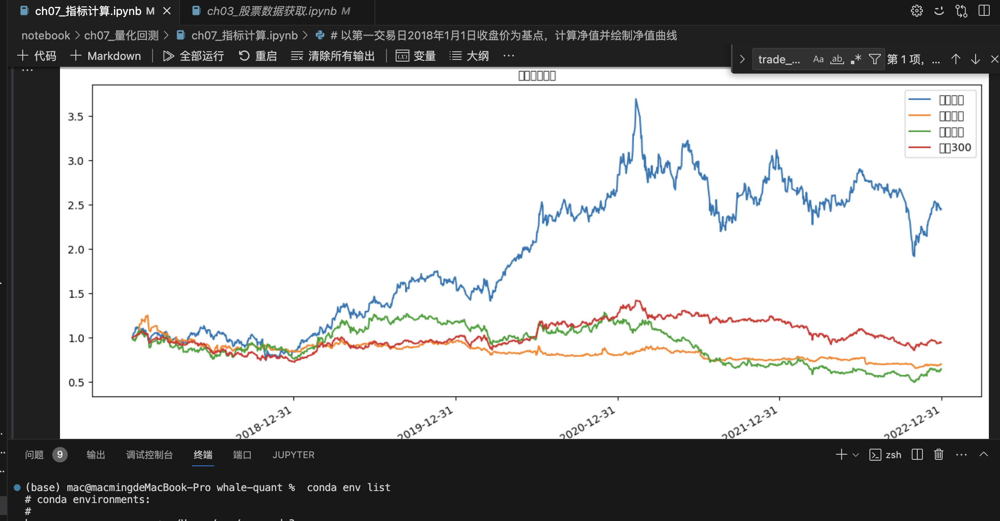
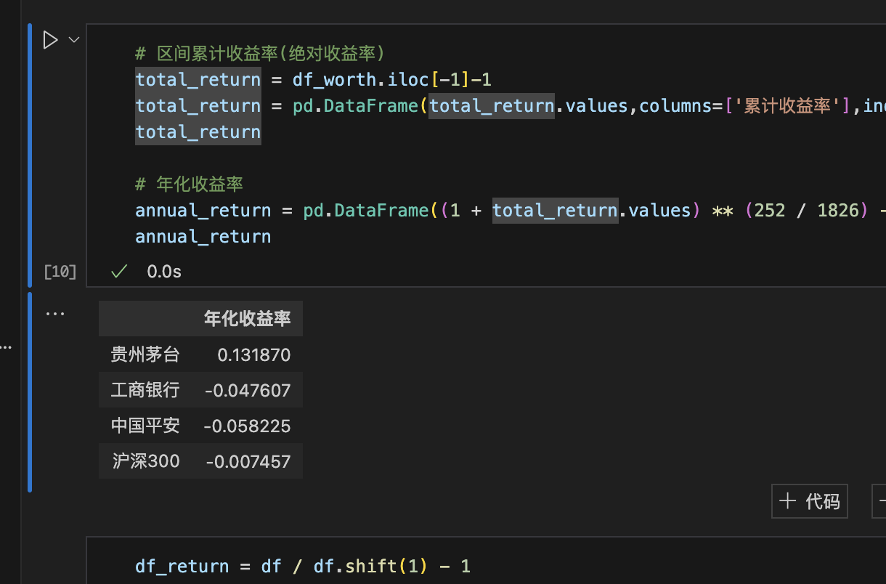
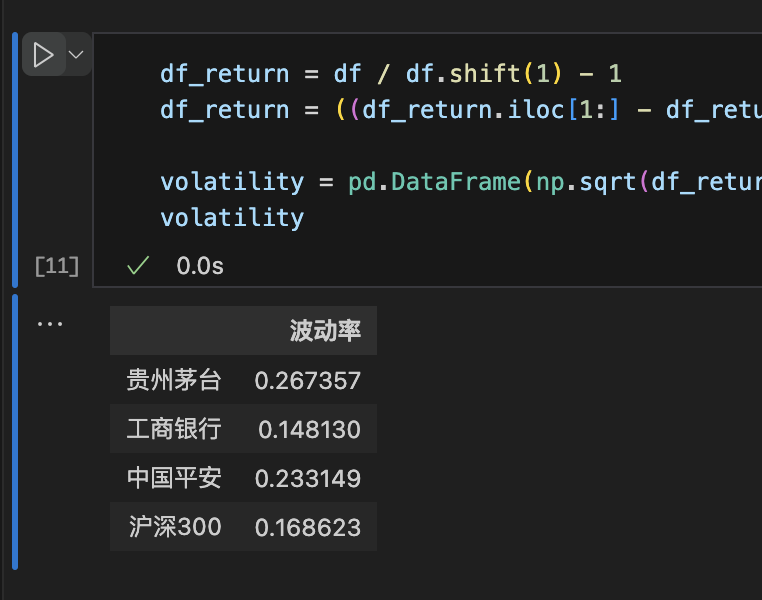
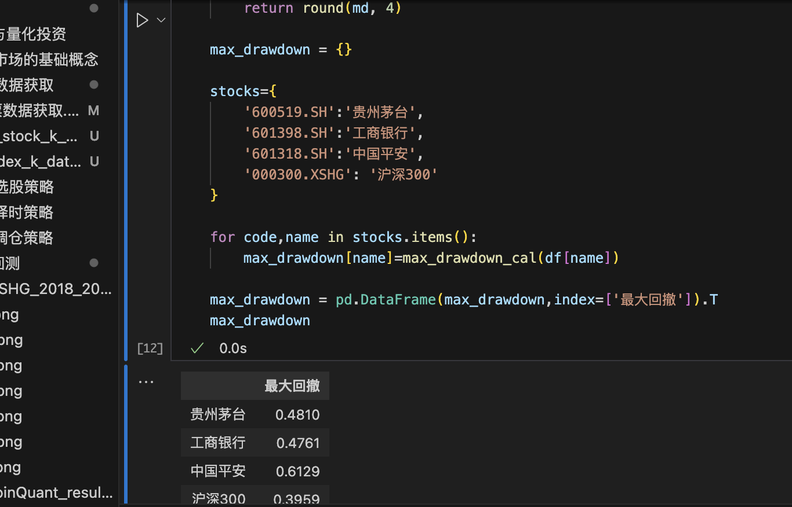
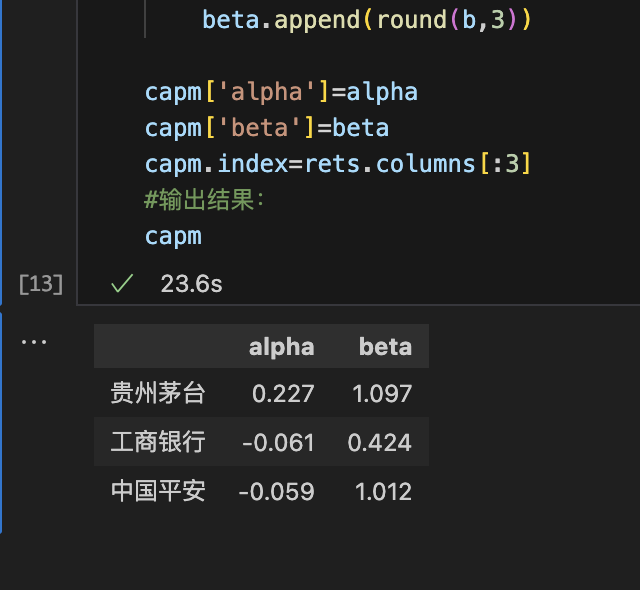
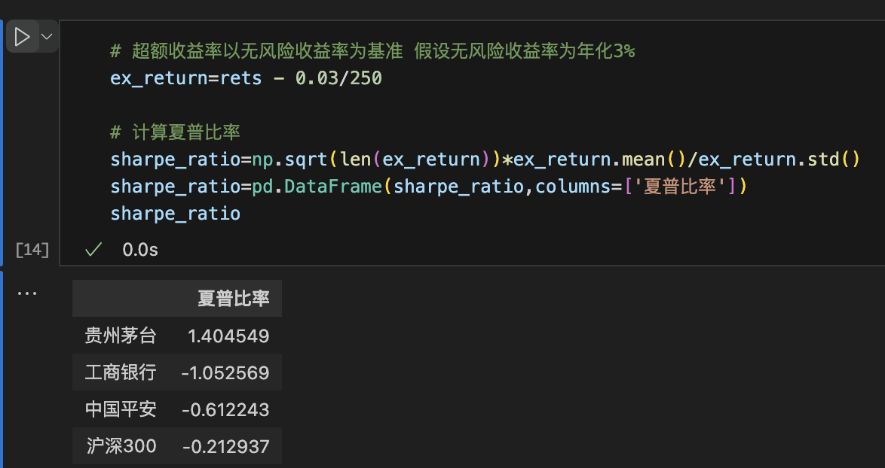
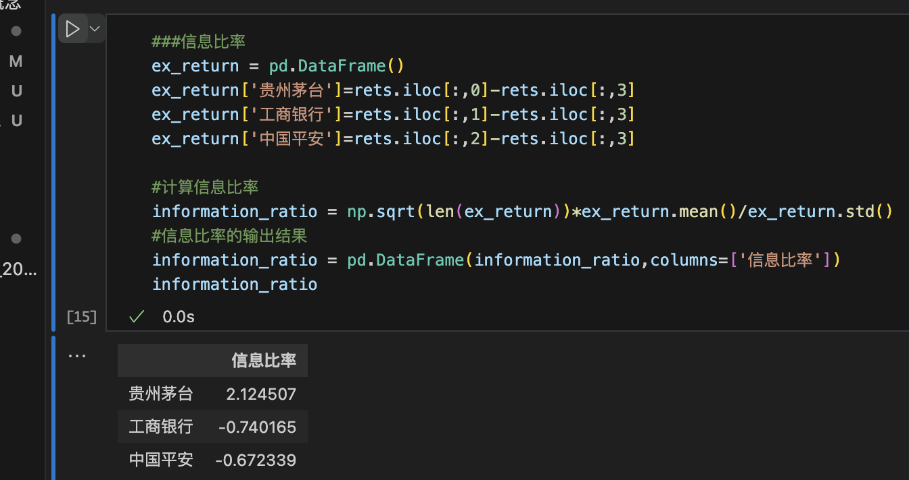

# 量化回测

本章介绍年化收益率、基准年化收益率、最大回撤等指标，并用实际代码运行，计算出某支股票的基本数据，手写一个策略，进行回测。本章也介绍了一些回测平台，用于体验。

## 股价净值走势
净值曲线是一组时间序列的曲线，其含义表示为股票或基金在不同时间的价值相对于期初的价值的倍数。

## 年化收益
年化收益的一个直观的理解是，假设按照某种盈利能力，换算成一年的收益大概能有多少。这

## 波动率
波动率是对收益变动的一种衡量，本质也是风险，波动率和风险，都是用来衡量收益率的不确定性的。我们用方差来表示，年波动率等于策略收益和无风险收益的标准差除以其均值，再除以交易日倒数的平方根，通常交易日取252天。

## 最大回撤
选定周期内任一历史时点往后推，于最低点时的收益率回撤幅度的最大值。最大回撤用来描述可能出现的最糟糕的情况。最大回撤是一个重要的风险指标，对于量化策略交易，该指标比波动率还重要。 P为某一天的净值，i为某一天，j为i后的某一天，Pi为第i天的产品净值，Pj则是Pi后面某一天的净值

## Alpha系数和Beta系数
前几节课里讲到的风险收益系数
Beta系数代表投资中的系统风险，而在投资中除了系统风险外还面临着市场波动无关的非系统性风险。 Alpha系数就代表投资中的非系统性风险，是投资者获得与市场波动无关的回报。

## 夏普比率
夏普比率（sharpe ratio）表示每承受一单位总风险，会产生多少的超额报酬，该比率越高。夏普比率是在资本资产定价模型进一步发展得来的。

## 信息比率
信息比率含义与夏普比率类似，只不过其参照基准不是无风险收益率，而是策略的市场基准收益率。

